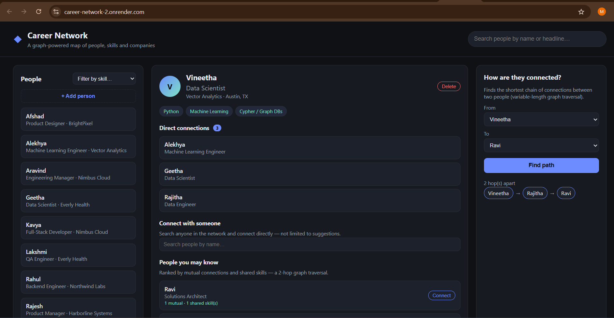
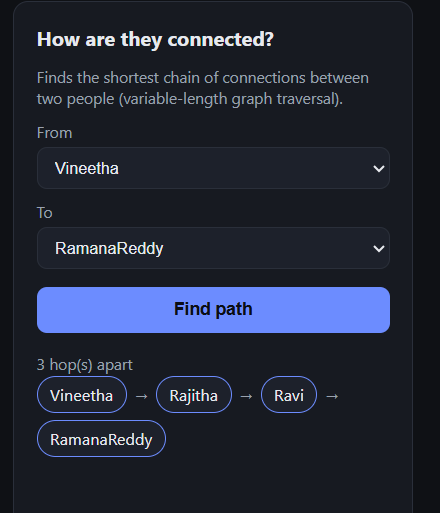
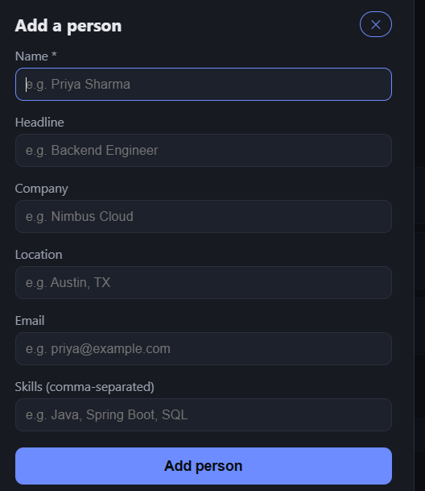

# Career Network

A small, complete graph-database-backed application built for the **WEXA AI take-home assignment**.

Career Network is a LinkedIn-style professional network where you can search
people, view their profile (company + skills), see their direct connections,
get "people you may know" recommendations, add or remove people, and find the
shortest chain of connections between any two people. It runs on **CognoDB**
— a managed graph database that speaks openCypher over the Bolt protocol and
is fully compatible with the official Neo4j Java driver.

## Live demo

**[https://career-network-2.onrender.com/](https://career-network-2.onrender.com/)**

> ⚠️ **Note:** This is hosted on Render's **free tier**, which spins down the
> service after periods of inactivity. The **first request after idling can
> take up to 1–2 minutes** to respond while the instance wakes up — please be
> patient on first load. Subsequent requests will be fast until it idles
> again.

## Why a graph database?

A professional network is fundamentally a graph: people know people, work at
companies, and have skills that overlap in interesting ways. The questions
that matter are about **paths and relationships**, not isolated rows:

- *"How am I connected to this person?"* is a variable-length shortest-path
  query. In a relational schema this needs a self-referencing edge table plus
  a recursive CTE (or an application-side BFS loop) and gets slow fast as the
  network grows. In Cypher it's one line: `shortestPath((a)-[:KNOWS*..6]-(b))`.
- *"Who should I connect with next?"* (people-you-may-know) is a 2-hop
  traversal ranked by mutual connections and shared skills. In SQL this is a
  multi-way self-join on the friendship table combined with another join
  against a skills table — expensive and awkward to express, let alone keep
  fast. In Cypher it's a single readable `MATCH` pattern.
- The schema itself is naturally a graph: `(Person)-[:KNOWS]-(Person)`,
  `(Person)-[:WORKS_AT]->(Company)`, `(Person)-[:HAS_SKILL]->(Skill)`. Modeling
  this relationally would mean junction tables for every relationship type,
  and every "how are we connected" question becomes a chain of joins whose
  depth you don't know in advance.

Graph databases make relationship-first questions cheap and native instead of
bolted on, which is exactly what this use case needs.

## Data model

```
                (WORKS_AT)                         (HAS_SKILL)
   ┌────────┐  ───────────────▶  ┌─────────┐   ┌────────┐  ◀───────────────  ┌────────┐
   │ Person │                   │ Company │   │ Person │                   │ Skill  │
   └────────┘  ◀──────────────  └─────────┘   └────────┘                   └────────┘
       │  ▲              role, startYear
       │  │
       └──┘  (KNOWS, mutual/undirected)
```

- **`Person`** `{ id, name, headline, location, email }`
- **`Company`** `{ id, name, industry }`
- **`Skill`** `{ name }`
- **`(:Person)-[:WORKS_AT {role, startYear}]->(:Company)`**
- **`(:Person)-[:HAS_SKILL {level}]->(:Skill)`**
- **`(:Person)-[:KNOWS {since}]-(:Person)`** — a mutual connection, created in
  both directions via `MERGE`

18 people, 6 companies and 12 skills are loaded by the seed script, connected
by ~30 `KNOWS` relationships, which is enough to produce interesting mutual
connections, shared-skill overlaps and multi-hop paths.

## Technology stack

- **Backend**: Java 21, Spring Boot (Spring MVC, REST controllers)
- **Database**: CognoDB (openCypher over Bolt), accessed through the official
  **Neo4j Java Driver** — no ORM/OGM layer, every query is a hand-written,
  parameterized Cypher statement in `GraphRepository`
- **Frontend**: a single-page vanilla HTML/CSS/JS app (no build step) served
  as static resources by Spring Boot

## Project structure

```
src/main/java/com/vineetha/career_network/
  config/Neo4jDriverConfig.java     -> creates the shared driver, reads env vars
  model/                             -> Person, ConnectionSuggestion, PathResult, ConnectRequest
  repository/GraphRepository.java   -> every Cypher query lives here, parameterized
  service/PersonService.java        -> business logic / validation
  service/SeedDataLoader.java       -> loads seed.cypher on first startup only
  controller/PersonController.java  -> REST API
  controller/HealthController.java  -> DB connectivity check for the UI banner
  exception/GlobalExceptionHandler.java -> turns DB errors into friendly JSON
src/main/resources/
  seed.cypher                       -> the seed dataset (people/companies/skills/edges)
  application.properties            -> reads COGNODB_* env vars
  static/                           -> index.html, style.css, app.js (the UI)
```

## Setup

### 1. Create your CognoDB instance

1. Go to https://console.cognodb.com/signup and create a free account (no
   credit card required).
2. From the console, create a free (`c0`) instance and pick a region.
3. Copy the connection URI (`bolt+s://<instance-id>.databases.cognodb.cloud`)
   and the generated password for the user `cognodb` — it is shown once.

### 2. Configure credentials (never commit real secrets)

Set the following environment variables before running the app:

```powershell
$env:COGNODB_URI = "bolt+s://<your-instance-id>.databases.cognodb.cloud"
$env:COGNODB_USERNAME = "cognodb"
$env:COGNODB_PASSWORD = "<your-generated-password>"
```

`application.properties` reads these with `${COGNODB_URI:...}` placeholders,
so nothing sensitive needs to be committed — the fallback values in that file
are for local development only and should be replaced/removed before pushing
a public repository.

### 3. Run the app

```powershell
.\mvnw.cmd spring-boot:run
```

On first startup, `SeedDataLoader` checks whether the database is empty and,
if so, loads `src/main/resources/seed.cypher` automatically — nothing to run
by hand. Then open **http://localhost:8080**.

## The main queries, explained

All queries live in `GraphRepository.java` and are executed with bound
parameters via the official driver (`Values.parameters(...)` / a parameter
map) — never string concatenation.

- **`searchPeople` / `getPerson` / `getConnections` / `findBySkill`** — simple
  1-hop lookups that back the directory, profile panel and skill filter.
- **`suggestConnections`** *(multi-hop, 2 hops)* — "people you may know":
  finds friends-of-friends who are not already directly connected, ranks them
  by mutual-connection count and shared skills.
  ```cypher
  MATCH (me:Person {id: $id})
  OPTIONAL MATCH (me)-[:KNOWS]-(direct:Person)
  WITH me, collect(DISTINCT direct.id) AS directIds
  MATCH (me)-[:KNOWS]-(mutual:Person)-[:KNOWS]-(candidate:Person)
  WHERE candidate.id <> $id AND NOT candidate.id IN directIds
  WITH candidate, count(DISTINCT mutual) AS mutualConnections
  OPTIONAL MATCH (me2:Person {id: $id})-[:HAS_SKILL]->(s:Skill)<-[:HAS_SKILL]-(candidate)
  OPTIONAL MATCH (candidate)-[:WORKS_AT]->(c:Company)
  WITH candidate, c, mutualConnections, count(DISTINCT s) AS sharedSkills
  RETURN candidate, c.name AS company, mutualConnections, sharedSkills
  ORDER BY mutualConnections DESC, sharedSkills DESC, candidate.name
  LIMIT $limit
  ```
  > Note: the "already connected?" check is done by collecting direct-connection
  > ids up front rather than a `NOT (a)-[:KNOWS]-(b)` pattern predicate or an
  > `OPTIONAL MATCH` between two already-bound nodes, working around a
  > query-engine quirk observed on the CognoDB instance used for this
  > assignment where those two pre-bound-node forms are not evaluated
  > correctly (verified independently against the raw Bolt connection).
- **`shortestPath`** *(multi-hop, variable length)* — "how are we connected?":
  ```cypher
  MATCH path = shortestPath((a:Person {id: $fromId})-[:KNOWS*1..6]-(b:Person {id: $toId}))
  RETURN path
  ```
  This is exactly the kind of query a relational database finds awkward:
  without a fixed hop count, you'd need a recursive CTE or an
  application-side breadth-first search across a friendship table.
- **`connect`** — idempotent `MERGE` to create a mutual `KNOWS` relationship.
- **`createPerson`** — creates a new `Person` node and, via `MERGE`, reuses
  (rather than duplicates) any existing `Company`/`Skill` nodes it links to.
- **`deletePerson`** — `DETACH DELETE`, removing the person and every
  relationship attached to them (connections, skills, employer) in one step.

## Engineering notes

- **Secrets**: connection URI/username/password come from `COGNODB_URI`,
  `COGNODB_USERNAME`, `COGNODB_PASSWORD` environment variables (see
  `Neo4jDriverConfig`), never hard-coded.
- **Error handling**: `Neo4jDriverConfig` verifies connectivity once at
  startup but only logs a warning on failure — the app still boots. Every
  request goes through `GlobalExceptionHandler`, which turns
  `ServiceUnavailableException` / `Neo4jException` into a `503`/`502` JSON
  response instead of a stack trace. The frontend polls `/api/health` every
  15s and shows a banner when the database is unreachable, and every panel
  has its own loading/empty/error state.

## Running the UI

Open http://localhost:8080 (local) or the
[live demo](https://career-network-2.onrender.com/) (hosted) — search or
browse people on the left, click one to see their profile, direct connections
and recommendations in the middle, and use the right-hand panel to find the
shortest connection path between any two people.

- **Add a person**: click **+ Add person** above the directory, fill in the
  form (name is required; company and skills are optional and are matched
  against existing ones or created on the fly) and submit.
- **Delete a person**: open their profile and click **Delete** — this removes
  the person and all of their relationships (connections, skills, employer).

## Screenshots

**Directory / search view**



**Person profile view**



**Shortest path view**


